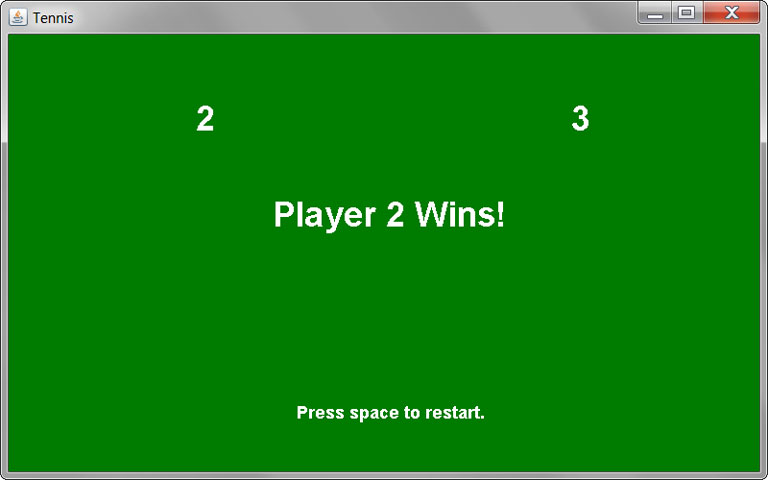

# Ping Pong Game

This application uses a mix of Java and Java FX 8 to display a ping pong game. To start the game, the user should press 'P' to play. 
Once the game starts, the user has to control how fast the paddles can move up and down the screen from each side to hit the ball. If one side 
misses, one of the players get a point. You need 3 points to win.

Download the code from Stella Gurin's GitHub and run it in your terminal or in any IDE of your preference.

*The images above are snapshots of what the application looks like when playing the game.*

Demo: https://stellagurin.github.io/Ping-Pong-Game/
